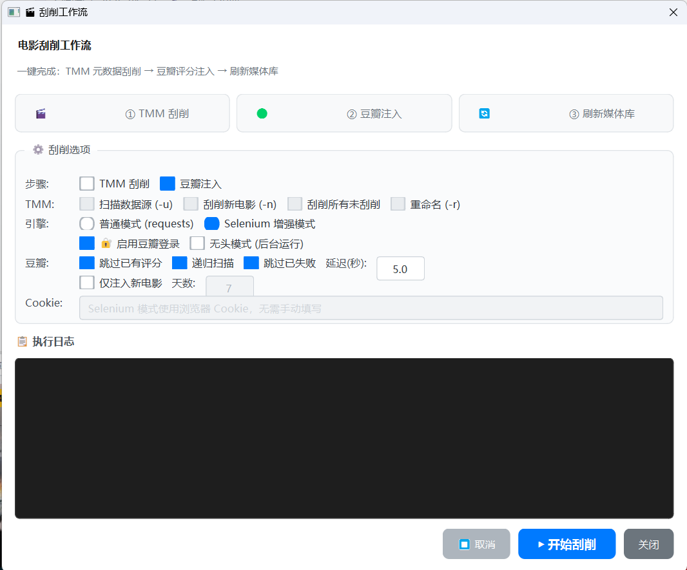

# Movie Manager Lite

一个面向本地/NAS 媒体库的电影海报墙应用，基于 PyQt6。  
支持 NFO 解析、海报缓存、增量刷新、离线容错与刮削工作流，适合个人影库长期维护。


## Screenshots

### 主页


### 系列电影页面


### 刮削工作流



## Highlights

- 海报墙 + 详情面板三栏布局，专注本地媒体浏览
- NFO 驱动的元数据展示与属性编辑
- 观看状态、收藏、用户评分、本地数据库管理
- 同名电影查重（用于快速清理重复资源）
- 右键菜单与详情快捷操作（播放、打开目录、更新海报、删除本地记录等）
- 刷新媒体库采用增量策略（只更新差异，不全量重建缓存）
- 海报缓存支持在线补齐与离线回退
- 可选 TinyMediaManager + 豆瓣注入刮削流程

## Table of Contents

- [Features](#features)
- [Project Structure](#project-structure)
- [Quick Start](#quick-start)
- [Configuration](#configuration)
- [Cache and Refresh Strategy](#cache-and-refresh-strategy)
- [Common Actions](#common-actions)
- [Scripts](#scripts)
- [Testing](#testing)
- [Documentation](#documentation)
- [Roadmap](#roadmap)
- [License](#license)

## Features

### Library and UI

- 本地媒体库扫描与可视化展示
- 详情页分阶段渲染，减少点击阻塞
- 系列电影视图与快速跳转

### Metadata and Management

- 解析 NFO 元信息（标题、年份、评分、演员、技术参数等）
- 属性编辑（NFO 编辑后自动回写内存与缓存）
- 观看历史、收藏、用户评分持久化

### Poster and Performance

- 可见区懒加载 + 批量加载
- 海报缓存索引与跨尺寸复用
- 在线模式可更新缺失高清海报缓存
- 离线模式优先使用本地缓存，降低 NAS 断连影响

### Refresh and Data Safety

- 增量刷新：仅更新新增/移除/变化电影
- 本地记录清理：自动移除无效观看历史/收藏引用
- 删除操作默认仅删除本地数据库记录，不删除服务器文件

## Project Structure

```text
Movie_Manager_Lite/
├── main.py
├── requirements.txt
├── data/                # 运行期数据（本地数据库/缓存索引）
├── docs/                # 说明文档
├── examples/
├── logo/
├── models/
├── packaging/
├── parsers/
├── scraper/
├── scripts/
├── styles/
├── tests/
├── tools/
├── ui/
└── utils/
```

## Quick Start

### 1) Install Dependencies

```bash
pip install -r requirements.txt
```

### 2) Run

```bash
python main.py
```

Windows 可直接运行 [scripts/启动.bat](scripts/启动.bat)。

## Configuration

运行数据统一存放于 [data](data) 目录：

- [data/config.json](data/config.json): 媒体库路径与界面配置
- [data/movie_cache.json](data/movie_cache.json): 电影缓存数据库
- [data/watch_history.json](data/watch_history.json): 观看历史
- [data/favorites.json](data/favorites.json): 收藏数据
- [data/failed_movies.json](data/failed_movies.json): 失败记录
- [data/scrape_config.json](data/scrape_config.json): 刮削配置
- [data/douban_cookies.pkl](data/douban_cookies.pkl): 豆瓣 Cookie

配置媒体库路径时，编辑 [data/config.json](data/config.json) 中的 movie_paths。

## Cache and Refresh Strategy

- 刷新媒体库使用增量更新，不主动删除本地海报/详情缓存
- 在线后台任务会补齐缺失缓存（海报墙尺寸 + 详情页高清尺寸）
- 可手动触发单片或全量海报更新（全量为“仅补缺失”）
- 离线场景下优先使用本地缓存，避免网络路径阻塞

## Common Actions

- 搜索栏右侧“同名”按钮：筛出片名重复电影
- 电影卡片右键菜单：播放、打开文件夹、更新 NFO、更新海报、属性、删除（本地）
- 详情页按钮栏：播放、收藏、网页、属性、文件夹、评分、更新海报、删除（本地）

## Scripts

- [scripts/启动.bat](scripts/启动.bat): 启动应用
- [scripts/build.bat](scripts/build.bat): 本地打包
- [tools/diagnostics](tools/diagnostics): 诊断脚本集合

## Testing

```bash
pytest -q
```

## Documentation

- [docs/使用指南.md](docs/使用指南.md)
- [docs/刮削功能说明.md](docs/刮削功能说明.md)
- [docs/缓存功能说明.md](docs/缓存功能说明.md)
- [docs/架构设计.md](docs/架构设计.md)
- [docs/打包说明.md](docs/打包说明.md)

## Roadmap

- 更细粒度的重复电影识别策略（按标题 + 年份 + 时长）
- 可配置的高清海报尺寸策略
- 更完整的发布与版本日志模板

## License

MIT License
